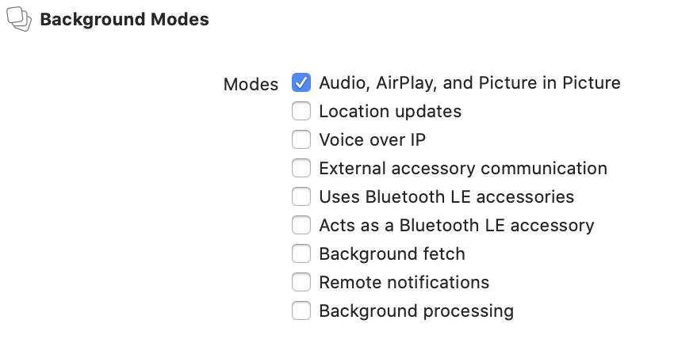

# Configuring the Audio Playback of iOS and tvOS Apps

## Info
> **Type**: `Article`
>
> **최근 수정일**: `2021-03-24`
>
> [원문 링크](https://developer.apple.com/documentation/avfoundation/media_playback_and_selection/configuring_the_audio_playback_of_ios_and_tvos_apps)

**Framework**

- AVFoundation

---

## Overview

대부분의 iOS 및 tvOS 용 미디어 재생 앱은 원하는 재생 동작을 활성화하기 위해 추가 구성이 필요합니다. 이 구성을 수행하면 앱의 오디오가 예상대로 동작하고, Airplay 스트리밍 및 백그라운드 오디오 재생과 같은 고급 기능을 활성화됩니다.

### 오디오 세션 구성

오디오 세션은 앱과 운영체제(오디오 하드웨어까지) 간의 중개자 역할을 합니다. 오디오 세션을 사용해 특정 동작이나 오디오 하드웨어와의 필수 상호작용을 자세히 설명하지 않고 앱 오디오의 특성을 운영체제에 전달하세요. 대신, 이러한 세부정보의 관리를 오디오 세션에 위임해 운영체제가 사용자의 오디오 경험을 최적으로 관리할 수 있게합니다.

모든 iOS 및 tvOS 앱에는 다음과 같이 이미 구성된 기본 오디오 세션이 있습니다:

- 앱에서 오디오를 재생할 떄, 다른 백그라운드 오디오는 음소거됩니다.
- 오디오 재생은 지원하지만 오디오 녹음은 허용하지 않습니다.(오디오 녹음은 tvOS에서 지원되지 않습니다)
- iOS에서 Ring/Silent 스위치를 무음모드로 설정하면 앱의 오디오가 무음으로 설정됩니다.
- iOS에서 기기를 잠그면 앱의 오디오가 음소거됩니다.

기본 오디오 세션은 유용한 동작을 제공하지만, 미디어 재생 앱을 만들 때 항상 필요한 동작은 아닙니다. 필요한 동작을 추가하기 위해서, 앱의 오디오 세션 카테고리를 설정하세요.

오디오 세션 카테고리는 앱에 필요한 일반적인 오디오 동작을 정의합니다. AVFoundation은 사용할 수 있는 여러 오디오 세션 카테고리를 정의하지만, 대부분의 미디어 재생앱에는 [playback](https://developer.apple.com/documentation/avfaudio/avaudiosession/category/1616509-playback) 카테고리가 필요합니다. 이 카테고리는 오디오 재생이 앱의 핵심 기능임을 나타냅니다. 이 카테고리를 지정하면, Ring/Silent 스위치가 무음모드로 설정된 상태에서도 앱의 오디오가 계속됩니다(iOS만 해당). 이 카테고리를 사용하면 "Audio, AirPlay, and Picture in Picture" 백그라운드 모드를 사용하는 경우 앱이 백그라운드 오디오를 재생할 수도 있습니다.

[AVAudioSession](https://developer.apple.com/documentation/avfaudio/avaudiosession) 객체를 사용해 앱의 오디오 세션을 구성하세요. AVAudioSession은 오디오 세션 카테고리 및 기타 설정 옵션을 설정하는데 사용하는 싱글톤 객체입니다. 앱 라이프사이클동안 오디오 세션과 상호작용할 수 있지만, 다음 예제와 같이 앱 시작 시, 카테고리를 설정하는게 유용한 경우가 많습니다:

```swift
func application(_ application: UIApplication,
                 didFinishLaunchingWithOptions launchOptions: [UIApplication.LaunchOptionsKey: Any]?) -> Bool {
    
    let audioSession = AVAudioSession.sharedInstance()
     do {
        try audioSession.setCategory(.playback)
     } catch {
         print("Setting category to AVAudioSessionCategoryPlayback failed.")
     }

    return true
}
```

이 카테고리를 활성화하려면, [setActive(_:options:)](https://developer.apple.com/documentation/avfaudio/avaudiosession/1616627-setactive) 메서드를 사용해 오디오 세션을 활성화하세요.

 
  **Note**

  카테고리를 설정한 후 언제든지 오디오 세션을 활성화할 수 있지만, 일반적으로 앱에서 오디오 재생을 시작할 때까지 이 호출을 연기하는게 좋습니다. 호출을 연기하면 진행 중인 다른 백그라운드 오디오가 너무 일찍 중단되는 일을 방지할 수 있습니다.
  

카테고리 설정은 오디오 세션과의 가장 작은 상호작용이지만 다른 구성 옵션 및 기능을 사용할 수 있습니다. 자세한 내용은 [AVAudioSession](https://developer.apple.com/documentation/avfaudio/avaudiosession) 을 참조하세요.

### 백그라운드 오디오 활성화

iOS 및 tvOS 앱에서는 일부 백그라운드 작업을 위해 특정 capabilties를 활성화해야 합니다. 재생 앱에 필요한 일반적인 기능은 백그라운드 오디오를 재생하는 것 입니다. 이 capability를 활성화하면, 사용자가 다른 앱으로 전환하거나 iOS 기기를 잠글 때도 앱의 오디오가 계속됩니다. 이 capability는 iOS에서 AirPlay 스트리밍 및 PIP(Picture in Picture) 재생과 같은 고급 재생 기능을 활성화하는데도 필요합니다.

이러한 capabilities을 구성하는 가장 간단한 방법은 Xcode를 사용하는 것입니다. Xcode에서 앱의 타겟을 선택하고 Signing & Capabilities 탭을 선택합니다. Capabilites 탭에서, Background Modes capability를 추가하고 background modes 목록에서 "Audio, AirPlay, and Picture in Picture" 옵션을 선택합니다.



이 모드를 활성화하고 오디오 세션을 구성하면, 앱에서 백그라운드 오디오를 재생할 수 있습니다.

## See Also

---

### Essentials

- [Creating a Basic Video Player (macOS)](https://developer.apple.com/documentation/avfoundation/media_playback_and_selection/creating_a_basic_video_player_macos)

  빌트인 컨트롤을 사용해 간단한 비디오 재생 앱을 만듭니다.

- [Creating a Basic Video Player (iOS and tvOS)](https://developer.apple.com/documentation/avfoundation/media_playback_and_selection/creating_a_basic_video_player_ios_and_tvos)

  빌트인 컨트롤을 사용해 간단한 비디오 재생 앱을 만듭니다.

- [Guidelines for Apple TV 4K Development](https://developer.apple.com/documentation/avfoundation/media_playback_and_selection/guidelines_for_apple_tv_4k_development)

  Apple TV 4K 용을 개발할 때, 다음 가이드라인을 따르세요.