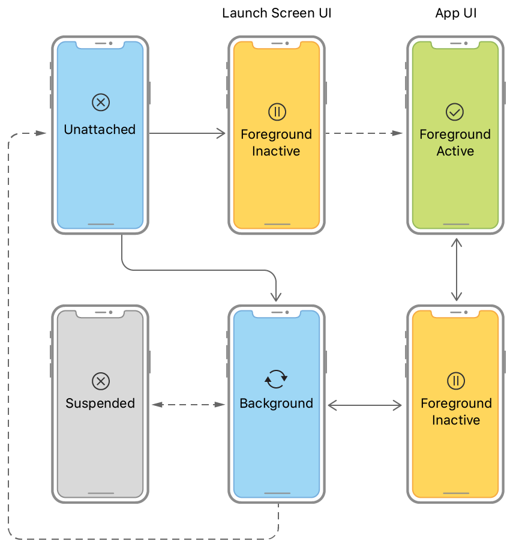

# Managing Your App's Life Cycle

## Info
> **Type**: `Article`
>
> **최근 수정일**: `2021-03-06`
>
> [원문 링크](https://developer.apple.com/documentation/uikit/app_and_environment/managing_your_app_s_life_cycle)

**Framework**

- UIKit

---

## Overview

앱의 현재 상태에 따라 언제든지 할 수 있는 작업과 할 수 없는 작업이 결정됩니다. 예를 들어, foreground 앱은 사용자의 주의를 끌기 때문에, CPU를 포함한 시스템 리소스에 우선순위를 갖습니다. 이와 반대로, background 앱은 화면 밖에 있기 때문에 최소한의 작업만을 수행해야하며, 가급적 아무것도 수행하지 않아야합니다. 앱이 상태에서 다른 상태로 변경되면, 그에 따라 동작을 조정해야합니다.

앱의 상태가 변경될 때, UIKit은 적절한 델리게이트 객체의 메서드를 호출하여 알립니다:

- iOS 13 이상 버전에서는, [UISceneDelegate](https://developer.apple.com/documentation/uikit/uiscenedelegate) 객체를 사용해 scene 기반 앱의 생명주기 이벤트에 응답합니다.
- iOS 12 이하 버전에서는, [UIApplicationDelegate](https://developer.apple.com/documentation/uikit/uiapplicationdelegate) 객체를 사용해 생명주기 이벤트에 응답합니다.


**Note**

앱이 scene 지원을 활성화하면, iOS는 iOS 13 이상 버전에서 항상 scene 델리게이트를 사용합니다. iOS 12 이하 버전에서는, 시스템이 앱 델리게이트를 사용합니다.


### Scene 기반 생명주기 이벤트에 응답하세요

앱이 scenes을 지원하는 경우, UIKit은 각 scene에 대해 별도의 생명주기 이벤트를 전달합니다. scene은 기기에서 실행되는 앱 UI의 한 인스턴스를 나타냅니다. 사용자는 각 앱에 대해 여러 scenes을 생성할 수 있고, 별도로 표시하거나 숨길 수 있습니다. 각 scene은 고유한 생명주기를 가지기 때문에, 서로 다른 실행상태에 있을 수 있습니다. 예를 들어, 한 scene이 background 또는 suspended 상태에 있을 때 다른 scene은 foreground 상태에 있을 수 있습니다.


**Important**

Scene 지원은 opt-in 기능입니다. 기본적으로 활성화하려면, [Specifying the Scenes Your App Supports](https://developer.apple.com/documentation/uikit/app_and_environment/scenes/specifying_the_scenes_your_app_supports) 에서 설명된 대로 [UIApplicationSceneManifest](https://developer.apple.com/documentation/bundleresources/information_property_list/uiapplicationscenemanifest) key를 앱의 Info.plist 파일에 추가하세요.


다음 figure는 scene의 상태 전환을 보여줍니다. 사용자 또는 시스템이 앱에 대한 새로운 scene을 요청하면, UIKit이 scene을 생성하고 unattached 상태에 둡니다. 사용자가 요청한 scenes는 화면에 나타나는 foreground로 빠르게 이동합니다. 시스템이 요청한 scene은 일반적으로 이벤트를 처리할 수 있도록 backgronud로 이동합니다. 예를 들어, 시스템은 위치 이벤트를 처리하기 위해 background에서 장면을 시작할 수 있습니다. 사용자가 앱의 UI를 닫으면, UIKit은 연결된 scene을 background 상태로 이동하고, 결국에는 suspended 상태로 이동합니다. UIKit은 리소스를 회수하기 위해 언제든지 background 또는 suspended scene의 연결을 해제하고, unattached 상태로 되돌릴 수 있습니다.

scene 전환을 사용해 다음 작업을 수행하세요:

- UIKit이 scene을 앱에 연결할 때, scene의 초기 UI를 구성하고 scene에 필요한 데이터를 로드하세요.
- foreground-active 상태로 전환할 때, UI를 구성하고 사용자와의 상호작용을 준비하세요. [Preparing Your UI to Run in the Foreground](https://developer.apple.com/documentation/uikit/app_and_environment/scenes/preparing_your_ui_to_run_in_the_foreground) 를 참조하세요.
- foreground-active 상태에서 나갈 때, 데이터를 저장하고 앱의 동작을 조용하게 하세요. [Preparing Your UI to Run in the Background](https://developer.apple.com/documentation/uikit/app_and_environment/scenes/preparing_your_ui_to_run_in_the_background) 를 참조하세요.
- background 상태에 진입하면, 중요한 작업을 완료하고, 가능한 많은 메모리를 해제하고, 앱 스냅샷을 준비하세요. [Preparing Your UI to Run in the Background](https://developer.apple.com/documentation/uikit/app_and_environment/scenes/preparing_your_ui_to_run_in_the_background) 를 참조하세요.
- scene 연결이 해제되면, scene과 관련된 모든 공유 리소스를 정리하세요.
- Scene 관련 이벤트 외에도, [UIApplicationDelegate](https://developer.apple.com/documentation/uikit/uiapplicationdelegate) 객체를 사용해 앱 시작에 응답해야합니다. 앱 시작 시 수행할 작업에 대한 정보는 [Responding to the Launch of Your App](https://developer.apple.com/documentation/uikit/app_and_environment/responding_to_the_launch_of_your_app) 를 참조하세요.

### 앱 기반 생명주기 이벤트에 응답하세요

iOS 12 이하 버전, 그리고 scenes을 지원하지 않는 앱의 경우 UIKit은 모든 생명주기 이벤트를  [UIApplicationDelegate](https://developer.apple.com/documentation/uikit/uiapplicationdelegate) 객체에 전달합니다. 앱델리게이트는 별도로 화면에 표시되는 것을 포함한 앱의 모든 윈도우를 관리합니다. 따라서, 앱 상태 전환은 외부 디스플레이의 컨텐츠를 포함하여 앱의 전체 UI에 영향을 줍니다.

다음 figure는 앱델리게이트 객체와 관련된 상태 전환을 보여줍니다. 앱 시작 후, 시스템은 UI가 화면에 표시될 것인지 여부에 따라 앱을 inactive 또는 background 상태로 전환합니다. foreground로 시작하면, 시스템은 자동으로 앱을 active 상태로 전환합니다. 이 후, 상태는 앱이 종료될 때까지 active와 background 사이에서 변동합니다.

앱 전환을 사용해 다음 작업을 수행하세요:

- 시작하면, 앱의 데이터 구조와 UI를 초기화하세요. [Responding to the Launch of Your App](https://developer.apple.com/documentation/uikit/app_and_environment/responding_to_the_launch_of_your_app) 를 참조하세요.
- 활성화되면, UI 구성을 완료하고 사용자와의 상호작용을 준비하세요. [Preparing Your UI to Run in the Foreground](https://developer.apple.com/documentation/uikit/app_and_environment/scenes/preparing_your_ui_to_run_in_the_foreground) 를 참조하세요.
- 비활성화 시, 데이터를 저장하고 앱의 동작을 조용하게 하세요. [Preparing Your UI to Run in the Background](https://developer.apple.com/documentation/uikit/app_and_environment/scenes/preparing_your_ui_to_run_in_the_background) 를 참조하세요.
- background 상태에 진입하면, 중요한 작업을 완료하고, 가능한 많은 메모리를 해제하고, 앱 스냅샷을 준비하세요. [Preparing Your UI to Run in the Background](https://developer.apple.com/documentation/uikit/app_and_environment/scenes/preparing_your_ui_to_run_in_the_background) 를 참조하세요.
- 종료되면, 모든 작업을 즉시 중단하고 모든 공유 리소스를 해제하세요. [`applicationWillTerminate(_:)`](https://developer.apple.com/documentation/uikit/uiapplicationdelegate/1623111-applicationwillterminate) 를 참조하세요.

### 다른 중요 이벤트에 응답하세요

생명주기 이벤트를 처리하는 것 뿐 아니라, 앱은 다음 표에 나열된 이벤트를 처리할 준비가 되어있어야 합니다. [UIApplicationDelegate](https://developer.apple.com/documentation/uikit/uiapplicationdelegate) 객체를 사용해 이러한 이벤트의 대부분을 처리하세요. 경우에 따라 알림을 사용해 이벤트를 처리할 수도 있으므로 앱의 다른 부분에서 응답할 수 있습니다.

| Memory warnings                              | 앱의 메모리 사용량이 너무 높을 때 수신됩니다. 앱이 사용하는 메모리의 양을 줄이세요. [Responding to Memory Warnings](https://developer.apple.com/documentation/uikit/app_and_environment/managing_your_app_s_life_cycle/responding_to_memory_warnings) 을 참조하세요. |
| -------------------------------------------- | ------------------------------------------------------------ |
| Protected data becomes available/unavailable | 사용자가 기기를 lock 또는 unlock 했을 때 수신됩니다. [`applicationProtectedDataDidBecomeAvailable(_:)`](https://developer.apple.com/documentation/uikit/uiapplicationdelegate/1623044-applicationprotecteddatadidbecom) 와 [`applicationProtectedDataWillBecomeUnavailable(_:)`](https://developer.apple.com/documentation/uikit/uiapplicationdelegate/1623019-applicationprotecteddatawillbeco) 를 참조하세요. |
| Handoff tasks                                | [NSUserActivity](https://developer.apple.com/documentation/foundation/nsuseractivity) 객체를 처리해야할 때 수신됩니다. [`application(_:didUpdate:)`](https://developer.apple.com/documentation/uikit/uiapplicationdelegate/1622963-application) 를 참조하세요. |
| Time changes                                 | 통신사가 시간 업데이트를 보내는 경우와 같이 여러 다른 시간 변경에 대해 수신됩니다. [`applicationSignificantTimeChange(_:)`](https://developer.apple.com/documentation/uikit/uiapplicationdelegate/1622992-applicationsignificanttimechange) 를 참조하세요. |
| Open URLs                                    | 앱에서 리소스를 열어야 할 때 수신됩니다. [`application(_:open:options:)`](https://developer.apple.com/documentation/uikit/uiapplicationdelegate/1623112-application) 를 참조하세요. |

## Topics

### Behavioral Events

---

- [Responding to Memory Warnings](https://developer.apple.com/documentation/uikit/app_and_environment/managing_your_app_s_life_cycle/responding_to_memory_warnings)

  시스템이 요청할 때, 메모리를 해제하세요.

## See Also

### 생명주기

---

- [Responding to the Launch of Your App](https://developer.apple.com/documentation/uikit/app_and_environment/responding_to_the_launch_of_your_app)

  앱의 데이터 구조를 초기화하고, 실행 준비 및 시스템의 launch-time 요청에 응답하세요.

- [`class UIApplication`](https://developer.apple.com/documentation/uikit/uiapplication)

  iOS에서 실행되는 앱 제어 및 조정의 가장 중요한 지점(centralized point)

- [`protocol UIApplicationDelegate`](https://developer.apple.com/documentation/uikit/uiapplicationdelegate)

  앱의 공유 동작(shared behavior)을 관리하기 위한 메서드 집합

- [Scenes](https://developer.apple.com/documentation/uikit/app_and_environment/scenes)

  여러 앱 UI 인스턴스를 동시에 관리하고, 리소스를 적절한 인스턴스로 분배하세요.