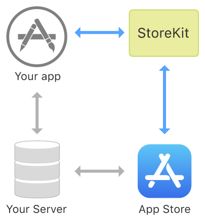

# In-App Purchase

## Info
> **Type**: `Collection`
>
> **최근 수정일**: `2021-03-06`
>
> [원문 링크](https://developer.apple.com/documentation/storekit/in-app_purchase)

**Framework**

- StoreKit

---

## Overview

인앱 구매를 통해 사용자에게 인앱 콘텐츠 및 기능 구매의 기회를 제공할 수 있습니다. 소비자는 앱 내에서, 또는 앱스토어에서 직접 구매할 수 있습니다. 앱스토어에서 제품을 홍보하는 방법에 관한 정보는, [Promoting Your In-App Purchases](https://developer.apple.com/app-store/promoting-in-app-purchases/) 를 확인하세요.

StoreKit 프레임워크는 앱을 대신해 앱스토어에 연결하여 결제를 요청하고 안전하게 처리합니다. 그런 다음 프레임워크는 구입한 제품을 제공한 앱에 알립니다. 구매를 검증하기 위해, 앱스토어의 서버 또는 기기에서 영수증을 확인할 수 있습니다. 자동 갱신 구독의 경우, 앱스토어가 주요 구독 이벤트를 서버에 알릴 수도 있습니다.

### 앱스토어커넥트에서 인앱구매 설정

인앱 구매를 사용하기 위해, 반드시 앱스토어커넥트에서 제품의 첫 번째 설정을 해야합니다. 앱을 개발할 때, 제품을 추가 또는 제거하고 기존 제품을 구체화하거나 재구성할 수 있습니다. 자세한 내용은 [Workflow for configuring in-app purchases](https://help.apple.com/app-store-connect/#/devb57be10e7)에서 확인할 수 있습니다.

또한 여러 플랫폼에서 사용할 수 있는 앱 및 인앱 구매를 하나의 구매로 제공할 수 있습니다. 유니버셜 구매에 대한 더 자세하나 내용은  [App Store Connect Help](https://help.apple.com/app-store-connect/#/dev2cd126805) 에서 확인할 수 있습니다.

### 제품 유형 이해

다음과 같은 4가지 유형의 인앱구매를 제공할 수 있습니다:

- *Consumables* 은 한 번 사용하면 고갈되는 유형입니다. 이 유형은 여러 번 구매할 수 있습니다.
- *Non-consumables* 은 한 번만 구매할 수 있는 유형입니다. 이 유형은 만료되지 않습니다.
- 서비스 또는 콘텐츠에 대한 *Auto-renewable subscriptions* 은 한 번 구매하면 취소할 때까지 반복적으로 자동 갱신되는 유형입니다.
- 서비스 또는 콘텐츠에 대한 *Non-renewing subscriptions* 은 제한된 기간 동안 접근을 제공하며 자동으로 갱신되지 않습니다. 이 유형은 다시 구매할 수 있습니다.

StoreKit을 사용해 기기 간 non-consumables 과 auto-renewable subscriptions 유형의 구매를 동기화 및 복원할 수 있습니다. 사용자가 auto-renewable subscription 또는 non-renewing subscription 유형을 구매할 경우, 앱은 사용자의 모든 기기에서 구독을 사용할 수 있도록 하고, 기존 구매를 복원할 수 있도록 해야합니다.

## Topics

---

### 필수

- [Setting Up the Transaction Observer for the Payment Queue](https://developer.apple.com/documentation/storekit/in-app_purchase/setting_up_the_transaction_observer_for_the_payment_queue)

  옵저버를 추가해 앱이 트랜잭션을 수신하고 처리할 수 있도록 합니다.

- [Offering, Completing, and Restoring In-App Purchases](https://developer.apple.com/documentation/storekit/in-app_purchase/offering_completing_and_restoring_in-app_purchases)

  앱에서 트랜잭션을 가져오고, 완료 및 복원합니다.

- [`class SKPaymentQueue`](https://developer.apple.com/documentation/storekit/skpaymentqueue)

  앱스토어에서 처리할 결제 트랜잭션 큐

- [`protocol SKPaymentTransactionObserver`](https://developer.apple.com/documentation/storekit/skpaymenttransactionobserver)

  트랜잭션을 처리하고, 구매한 기능을 잠금해제하고, 프로모션한 인앱구매를 계속 진행하는 메서드의 집합

- [`protocol SKPaymentQueueDelegate`](https://developer.apple.com/documentation/storekit/skpaymentqueuedelegate)

  트랜잭션을 완료하는데 필요한 정보를 제공하기 위해 구현된 프로토콜

- [`class SKRequest`](https://developer.apple.com/documentation/storekit/skrequest)

  앱스토어에 대한 요청을 나타내는 추상 클래스

---

### 제품 정보

- [Loading In-App Product Identifiers](https://developer.apple.com/documentation/storekit/in-app_purchase/loading_in-app_product_identifiers)

  앱스토어에서 제품 정보를 검색하기 위해 인앱 제품의 고유 식별자(unique identifiers)를 로드합니다.

- [Fetching Product Information from the App Store](https://developer.apple.com/documentation/storekit/in-app_purchase/fetching_product_information_from_the_app_store)

  사용자에게 표시하기 위해 앱에서 판매하는 제품에 대한 최신 정보를 검색합니다.

- [`class SKProductsRequest`](https://developer.apple.com/documentation/storekit/skproductsrequest)

  앱스토어에서 지정된 제품 목록에 대해 지역화된 정보를 검색할 수 있는 객체

- [`class SKProductsResponse`](https://developer.apple.com/documentation/storekit/skproductsresponse)

  제품 목록에 대한 정보를 요청하기 위한 앱스토어 응답

- [`class SKProduct`](https://developer.apple.com/documentation/storekit/skproduct)

  앱스토어커넥트에 등록된 제품에 대한 정보

---

### 상점(Storefronts)

- [`class SKStorefront`](https://developer.apple.com/documentation/storekit/skstorefront)

  애플 앱스토어 상점의 위치와 고유한 식별자를 포함하는 객체

---

### 구매

- [Requesting a Payment from the App Store](https://developer.apple.com/documentation/storekit/in-app_purchase/requesting_a_payment_from_the_app_store)

  사용자가 구매할 제품을 선택하면 앱스토어에 결제 요청을 제출합니다.

- [Processing a Transaction](https://developer.apple.com/documentation/storekit/in-app_purchase/processing_a_transaction)

  트랜잭션 큐 옵저버를 등록하여 앱스토어에서 트랙잭션 업데이트를 가져오고 처리합니다.

- [`class SKPayment`](https://developer.apple.com/documentation/storekit/skpayment)

  앱에서 제공하는 추가 기능에 대한 결제를 처리하기 위한 앱스토어로의 요청

- [`class SKMutablePayment`](https://developer.apple.com/documentation/storekit/skmutablepayment)

  앱에서 제공하는 추가 기능에 대한 결제를 처리하기 위한 앱스토어로의 변경 가능한 요청

- [`class SKPaymentTransaction`](https://developer.apple.com/documentation/storekit/skpaymenttransaction)

  payment 큐의 객체

---

### 구매 검증

- [Choosing a Receipt Validation Technique](https://developer.apple.com/documentation/storekit/in-app_purchase/choosing_a_receipt_validation_technique)

  앱에 적합한 영수증 검증 타입을 선택합니다.

- [Validating Receipts with the App Store](https://developer.apple.com/documentation/storekit/in-app_purchase/validating_receipts_with_the_app_store)

  안전한 서버에서 앱스토어에서 이루어진 거래를 확인합니다.

- [`class SKReceiptRefreshRequest`](https://developer.apple.com/documentation/storekit/skreceiptrefreshrequest)

  사용자의 앱 거래를 나타내는 영수증을 새로고침하기 위한 요청

---

### 콘텐츠 전달

- [Unlocking Purchased Content](https://developer.apple.com/documentation/storekit/in-app_purchase/unlocking_purchased_content)

  구매를 검증한 후 사용자에게 콘텐츠를 제공합니다.

- [Persisting a Purchase](https://developer.apple.com/documentation/storekit/in-app_purchase/persisting_a_purchase)

  필요에 따라 계속 제품을 사용할 수 있도록 영구적인 구매 기록을 보관합니다.

- [Finishing a Transaction]()

  트랜잭션을 완료해 구매 프로세스를 마칩니다.

- [`class SKDownload`](https://developer.apple.com/documentation/storekit/skdownload)

  제품과 연관된 다운로드 가능한 콘텐츠

---

### 환불

- [Handling Refund Notifications](https://developer.apple.com/documentation/storekit/in-app_purchase/handling_refund_notifications)

  consumable, non-consumable, 그리고 non-renewing subscription products 유형에 대한 환불 중 생성된 알림에 응답합니다.

---

### 이전에 구매한 제품에 대한 접근 제공

- [Restoring Purchased Products](https://developer.apple.com/documentation/storekit/in-app_purchase/restoring_purchased_products)

  사용자에게 앱에서 구매를 복원하는 기능을 제공하여 구매한 콘텐츠에 대한 접근을 유지합니다.

- [`class SKReceiptRefreshRequest`](https://developer.apple.com/documentation/storekit/skreceiptrefreshrequest)

  사용자의 앱 거래를 나타내는 영수증을 새로고침하기 위한 요청

- [`class SKRequest`](https://developer.apple.com/documentation/storekit/skrequest)

  앱스토어에 대한 요청을 나타내는 추상 클래스

- [`class SKPaymentTransaction`](https://developer.apple.com/documentation/storekit/skpaymenttransaction)

  payment 큐의 객체

- [`func SKTerminateForInvalidReceipt()`](https://developer.apple.com/documentation/storekit/1620081-skterminateforinvalidreceipt)

  앱에을 사용할 수 있는 라이선스가 만료된 경우 앱을 종료합니다.

---

### 가족 공유

- [Supporting Family Sharing in Your App](https://developer.apple.com/documentation/storekit/in-app_purchase/supporting_family_sharing_in_your_app)

  가족 구성원에게 구독 및 non-consumable 제품을 공유하는 서비스를 제공합니다.

- [`var isFamilyShareable: Bool`](https://developer.apple.com/documentation/storekit/skproduct/3564805-isfamilyshareable)

  앱스토어커넥트에서 제품을 가족 공유에 사용할 수 있는지 여부를 나타내는 불린 값

- [func paymentQueue(SKPaymentQueue, didRevokeEntitlementsForProductIdentifiers: [String])](https://developer.apple.com/documentation/storekit/skpaymenttransactionobserver/3564804-paymentqueue)

  옵저버에게 사용자는 더 이상 하나 이상의 가족 공유 구매 권한이 없음을 알립니다.

---

### 구독

- [Subscriptions and Offers](https://developer.apple.com/documentation/storekit/in-app_purchase/subscriptions_and_offers)

  앱 내에서 구매를 통해 사용자에게 추가로 시간 기반 콘텐츠 및 서비스를 제공합니다.

---

### 프로모션

- [Promoting In-App Purchases](https://developer.apple.com/documentation/storekit/in-app_purchase/promoting_in-app_purchases)

  앱의 제품 페이지에 인앱 구매를 표시합니다.

- [Testing Promoted In-App Purchases](https://developer.apple.com/documentation/storekit/in-app_purchase/testing_promoted_in-app_purchases)

  앱스토에서 앱이 사용 능해지기 전에 인앱구매를 테스트합니다.

- [`class SKProductStorePromotionController`](https://developer.apple.com/documentation/storekit/skproductstorepromotioncontroller)

  기기 별 인앱 구매의 주문 및 가시성을 사용자 지정하기 위한 제품 프로모션 컨트롤러

---

### 인앱 구매 테스팅

- [Testing at All Stages of Development with Xcode and Sandbox](https://developer.apple.com/documentation/storekit/in-app_purchase/testing_at_all_stages_of_development_with_xcode_and_sandbox)

  개발 과정에서 코드를 테스트하여 인앱구매 구현을 검증합니다.

- [Setting Up StoreKit Testing in Xcode](https://developer.apple.com/documentation/xcode/setting_up_storekit_testing_in_xcode)

  로컬에서 구성한 데이터로 인앱구매를 테스트하도록 테스트 환경을 설정합니다.

- [Testing In-App Purchases in Xcode](https://developer.apple.com/documentation/storekit/in-app_purchase/testing_in-app_purchases_in_xcode)

  로컬에서 구성한 제품 데이터를 사용해 인앱 구매 구현을 테스트 및 디버깅합니다.

- [Testing In-App Purchases with Sandbox](https://developer.apple.com/documentation/storekit/in-app_purchase/testing_in-app_purchases_with_sandbox)

  샌드박스 환경에서 실제 제품 정보와 서버 간의 트랜잭션을 사용해 인앱구매 구현을 테스트합니다.