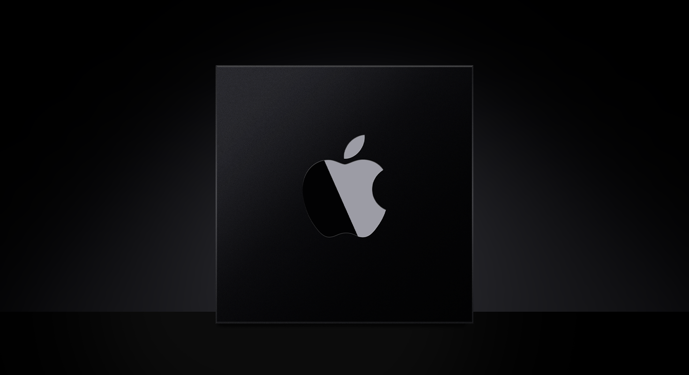

# Apple Silicon

## Info
> **Type**: `Collection`
>
> **최근 수정일**: `2021-03-06`
>
> [원문 링크](https://developer.apple.com/documentation/apple_silicon)

---

## Overview

애플 실리콘에서 네이티브하게 작동하는 앱, 프레임워크, 플러그인 그리고 다른 실행 파일을 구축하세요. 애플 프레임워크 및 기술에 기반하여 실행파일을 구축할 때 중요한 단계는 arm64 아키텍처를 위해 코드를 다시 컴파일하는 것입니다. 하드웨어별 세부 정보를 사용하거나 low-level의 기능이 필요할 경우 애플 실리콘을 지원하기 위해 필요에 따라 코드를 수정하세요. 

최상의 성능을 위해 애플 실리콘은 가끔 하드웨어 리소스 사용 방식을 조정합니다. 가능한 higer-level 기술을 사용해 하드웨어에 대한 의존성을 최소화하세요. 예시로, 직접 스레드를 생성, 관리하는 대신 Grand Central Dispath를 사용하세요. 애플 실리콘에서 변경 사항을 테스트하여 수정한 코드가 최적으로 작동하는지 확인해보세요.

## Topics

---

### 필수

- [Porting Your macOS Apps to Apple Silicon](https://developer.apple.com/documentation/xcode/porting_your_macos_apps_to_apple_silicon)

  애플 실리콘과 인텔 기반 맥 컴퓨터 모두에서 동작할 수 있는 버전의 맥앱을 만듭니다.

- [Building a Universal macOS Bunary](https://developer.apple.com/documentation/xcode/building_a_universal_macos_binary)

  애플 실리콘과 인텔 기반 맥 컴퓨터 모두에서 네이티브하게 동작할 수 있는 맥 앱 및 다른 실행가능한 코드를 만듭니다.

---

### 일반적인 이식 팁

- [Addressing Architectural Differences in Your macOS Code](https://developer.apple.com/documentation/apple_silicon/addressing_architectural_differences_in_your_macos_code)

  애플 실리콘과 인텔 기반 맥 컴퓨터 간의 아키텍처 차이에서 발생하는 문제를 해결합니다.

- [Porting Your Audio Code to Apple Silicon](https://developer.apple.com/documentation/audiounit/porting_your_audio_code_to_apple_silicon)

  애플 실리콘 맥 컴퓨터에서 실행할 때 발생하는 특정 오디오 코드의 이슈를 제거합니다.

- [Porting Just-In-Time Compilers to Apple Silicon](https://developer.apple.com/documentation/apple_silicon/porting_just-in-time_compilers_to_apple_silicon)

  강화된 런타임 기능과 애플 실리콘에서 동작하도록 just-in-time(JIT) 컴파일러를 수정합니다.

---

### 그래픽

- [Porting Your Metal Code to Apple Silicon](https://developer.apple.com/documentation/metal/porting_your_metal_code_to_apple_silicon)

  애플 실리콘과 인텔 기반 맥 컴퓨터 모두에서 동작하는 메탈 앱의 버전을 만듭니다.

---

### 성능

- [Turning Your Code's Performance for Apple Silicon](https://developer.apple.com/documentation/os/workgroups/tuning_your_code_s_performance_for_apple_silicon)

  애플 실리콘과 인텔 기반 맥 컴퓨터 모두에서 최상의 성능을 얻기 위해 코드를 개선합니다.

---

### Rosetta

- [About the Rosetta Translation Environment](https://developer.apple.com/documentation/apple_silicon/about_the_rosetta_translation_environment)

  어떻게 로제타가 실행 파일을 변환하는지 학습하고, 로제타가 변환할 수 없는 것은 무엇인지 이해합니다.

---

### 맥에서의 iOS 앱

- [Running Your iOS Apps on macOS](https://developer.apple.com/documentation/apple_silicon/running_your_ios_apps_on_macos)

  애플 실리콘 기반 맥에서 수정 없이 iOS 앱을 실행합니다. 하지만 macOS에서 앱이 실행될 수 없는 경우에는 제외됩니다.
  
- [Adapting iOS Code to Run in the macOS Environment](https://developer.apple.com/documentation/apple_silicon/adapting_ios_code_to_run_in_the_macos_environment)

  애플 실리콘에서 실행할 때 더 나은 사용자 경험을 제공하는 최신 iOS 기능을 지원합니다.

---

### 커널 및 드라이버

- [Implementing Drivers, System Extensions, and Kexts](https://developer.apple.com/documentation/apple_silicon/implementing_drivers_system_extensions_and_kexts)

  하드웨어와 통신하고 low-level 서비스를 제공하기 위해 몇 가지 작업에만 커널 익스텐션을 사용하여 드라이버 및 시스템 익스텐션을 생성합니다.

- [Installing a Custom Kernel Extension](https://developer.apple.com/documentation/apple_silicon/installing_a_custom_kernel_extension)

  custom installer package를 사용해 커널 익스텐션을 설치하고, 사용자가 설치 프로세스를 이해할 수 있도록 돕습니다.

- [Debugging a Custom Kernel Extension](https://developer.apple.com/documentation/apple_silicon/debugging_a_custom_kernel_extension)

  두번째 맥에서 커스텀 커널 익스텐션을 디버깅할 수 있도록 시스템을 구성합니다.
