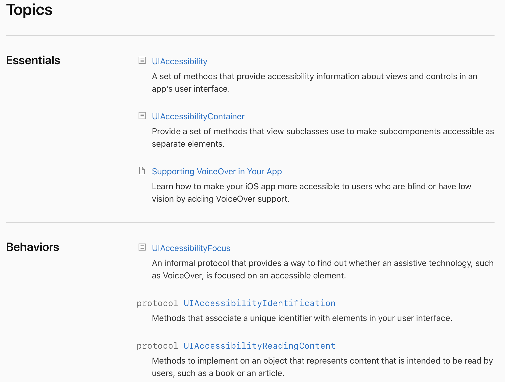

# 작성 전 꼭 확인해주세요!

1. 문서는 기본적으로 애플 개발자 공식 문서를 기반으로 합니다.
2. 모든 문서와 파일명의 띄어쓰기를 언더바(_)로 대치해주세요.
3. 파일명의 따옴표(')는 **반드시**!! 삭제해주세요.
4. 기본적으로 애플 개발자 공식 문서의 정렬과 디렉토리 구조를 따르지만, url 길이가 제한되기 때문에 모든 문서는 `프레임워크/컬렉션` 을 마지막으로 하위 디렉토리를 생성하지 않습니다. SUMMARY.md 파일에서 공식 문서에 따라 디렉토리 구조를 구성합니다.
   - 상위 디렉토리가 존재하지 않을 경우 생성해주세요.
   - 문서명이 중복되는 경우를 피하기 위해 다음 예시를 확인해주세요.
     - 예시: init?(coder: NSCoder)를 UIView.init?(coder: NSCoder)와 UIViewController.init?(coder: NSCoder)와 같이 표기합니다.
   - 디렉토리명에 해당하는 문서일 경우 파일명을 README로 생성해주세요.
     - 예시: UIKit의 문서일 경우, UIKit 디렉토리 생성 후, 해당 디렉토리의 README로 md파일 생성
5. Resource(image, video 등)가 존재할 경우, 문서와 같은 경로의 resource 디렉토리에 추가해 사용해주세요.
   - 리소스명: 제목(카멜케이스)_(figure+리소스번호)
6. 원문 링크를 제외한 모든 링크는 상대경로로 지정해 사용해주세요.

- 예시: ``, `[UIKit](Document/App Frameworks/UIKit/README.md)`

  1. Type이 없다면 Collection으로 기재해주세요.
  2. 최대한 애플 개발자 공식 문서와 같은 형식으로 작성해주세요.
     - H1: 제목
     - H2: On This Page에 기재된 목차
     - H1, H2는 번역하지 않고 영어 그대로 기재해주세요.
     - 구분선(---)을 그대로 사용해주세요.
  3. 문서 번역도중 링킹이 필요한 부분이 있다면 gitbook에서 해당 문서가 존재하는지 검색 후 다음과 같이 기재해주세요. 만약 존재하지 않는다면 원문의 링크를 그대로 기재해주세요

  - 문서 O: \[UIKit](Document/App Frameworks/UIKit/README.md)
  - 문서 X: \[UIKit](https://developer.apple.com/documentation/uikit)

  1. 번역이 애매하거나 통용적으로 사용되는 단어, 문서의 제목, 메서드 등은 번역하지 말아주세요.

  - 예시: github - 깃허브, low-level, Building a Univeral macOS Binary

  

  # 형식 예제

  ## 1. 기본

  

  ```
  ---
  description: An object that manages image-based content and allows you to perform animations on that content.
  ---
  
  # CALayer
  
  ## Info
  > **Type**: `Class`
  >
  > **최근 수정일**: `2020-12-23`
  >
  > [원문 링크](https://developer.apple.com/documentation/quartzcore/calayer)
  
  **Availability**
  
  - iOS 2.0+
  - macOS 10.5+
  - Mac Catalyst 13.0+
  - tvOS 9.0+
  
  **Framework**
  
  - Core Animation
  
  ```

  

  ## 2. Topics, See Also

  

  ```
  ## Topics
  
  ### Essentials
  
  - [UIAccessiblity]()
  
    A set of methods that provide accessibility ~
  
  - [UIAccessbilityContainer]()
  
    Provide a set of methods ~ 
  
  - [Supporting VoiceOver in Your App]()
  
    Learn how to make your iOS app more acessible to ~
  
  ### Behaviors
  
  - [UIAccessibilityFocus]()
  
    An informal protocol that ~
  
  - [`protocol UIAccessibiltyIdentification`]()
  
    Methods that associate a unique identifier with elements ~
  
  - [`protocol **UIAccessibilityRenderingContent`]()
  
    Methods to implement on an object that represents ~
  ```

  

  ## 3. Hints and Callouts

  

  ```
  
  **Warning**
  
  The RunLoop class is generally not considered to be thread-safe and its methods should only be ~
  
  
  hint style: info, success, danger, warning
  ```

  