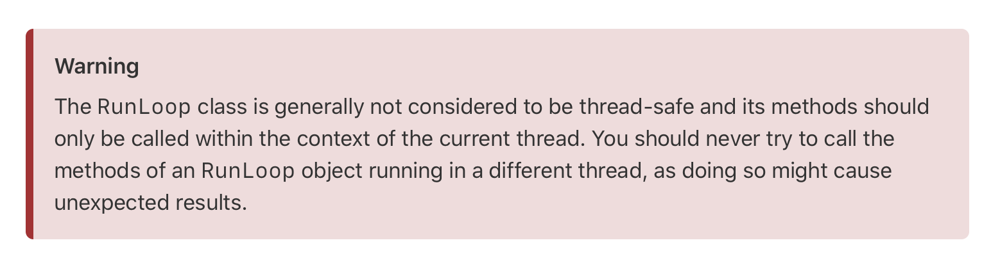

# ADD-KR (Document)

🍎 Apple Developer Document 한국어 번역 프로젝트입니다. [Apple Developer Document 링크](https://developer.apple.com/documentation/technologies)를 기반으로 번역합니다. [Github](https://github.com/DAEUN28/ADD-KR)에서는 문서 작업만 진행하고 [Gitbook](https://acone1128.gitbook.io/add/)에서 문서를 편리하게 확인할 수 있습니다.

# 작성 전 꼭 확인해주세요!

1. 문서는 기본적으로 애플 개발자 공식 문서를 기반으로 합니다.
2. 모든 문서와 파일명의 띄어쓰기를 하이픈(-)으로 대치해주세요.
3. 반드시 올바른 경로에 문서를 저장해주세요.
   - 상위 디렉토리가 존재하지 않을 경우 생성해주세요.
   - 디렉토리명에 해당하는 문서일 경우 파일명을 README로 생성해주세요.
     - 예시: UIKit의 문서일 경우, UIKit 디렉토리 생성 후, 해당 디렉토리의 README로 md파일 생성
4. Resource(image, video 등)가 존재할 경우, 문서와 같은 경로의 resource 디렉토리에 추가해 사용해주세요.
  - 리소스명: 제목(카멜케이스)-(figure+리소스번호)
5. 원문 링크를 제외한 모든 링크는 상대경로로 지정해 사용해주세요.
  - 예시: ``, `[UIKit](Document/App Frameworks/UIKit/README.md)`
6. Type이 없다면 Collection으로 기재해주세요.
7. 최대한 애플 개발자 공식 문서와 같은 형식으로 작성해주세요.
   - H1: 제목
   - H2: On This Page에 기재된 목차
   - H1, H2는 번역하지 않고 영어 그대로 기재해주세요.
   - 구분선(---)을 그대로 사용해주세요.
8. 문서 번역도중 링킹이 필요한 부분이 있다면 gitbook에서 해당 문서가 존재하는지 검색 후 다음과 같이 기재해주세요.
  - 문서 O: [UIKit](Document/App Frameworks/UIKit/README.md)
  - 문서 X: UIKit
9. 번역이 애매하거나 통용적으로 사용되는 단어, 문서의 제목, 메서드 등은 번역하지 말아주세요.
  - 예시: github - 깃허브, low-level, Building a Univeral macOS Binary


# 형식 예제

## 1. 기본


```markdown
---
description: An object that manages image-based content and allows you to perform animations on that content.
---

# CALayer

## Info
> **Type**: `Class`
>
> **최근 수정일**: `2020-12-23`
>
> [원문 링크](https://developer.apple.com/documentation/quartzcore/calayer)

**Availability**

- iOS 2.0+
- macOS 10.5+
- Mac Catalyst 13.0+
- tvOS 9.0+

**Framework**

- Core Animation

```


## 2. Topics, See Also


```markdown
## Topics

### Essentials

- **UIAccessiblity**

  A set of methods that provide accessibility ~

- **UIAccessbilityContainer**

  Provide a set of methods ~ 

- **Supporting VoiceOver in Your App**

  Learn how to make your iOS app more acessible to ~

### Behaviors

- **UIAccessibilityFocus**

  An informal protocol that ~

- protocol **UIAccessibiltyIdentification**

  Methods that associate a unique identifier with elements ~

- protocol **UIAccessibilityRenderingContent**

  Methods to implement on an object that represents ~
```


## 3. Hints and Callouts



```markdown

Warning
The RunLoop class is generally not considered to be thread-safe and its methods should only be ~


hint style: info, success, danger, warning
```


**Warning**
The RunLoop class is generally not considered to be thread-safe and its methods should only be ~
