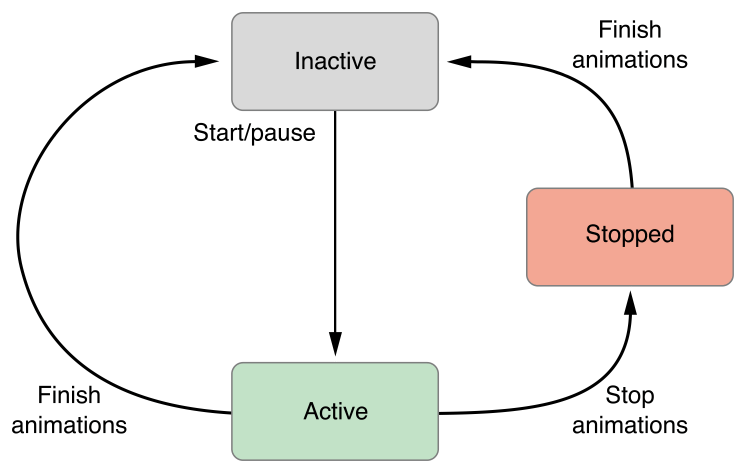

# UIViewAnimating

## Info
> **Type**: `Protocol`
>
> **최근 수정일**: `2021-05-16`
>
> [원문 링크](https://developer.apple.com/documentation/uikit/uiviewanimating)

**Availability**

- iOS 10.0+
- Mac Catalyst 13.0+
- tvOS 10.0+

**Framework**

- UIKit

---

## Declaration

```swift
protocol UIViewAnimating
```

## Overview

UIViewAnimating 프로토콜은 시작, 중지, 일시정지 기능을 포함해 애니메이션에 대한 기본 흐름 제어를 구현하기 위한 메서드를 정의합니다. 애니메이션의 현재 상태를 반영하고 애니메이션이 진행되는 동안 해당 상태를 수정하기 위한 여러 속성도 있습니다.

일반적으로, 이 프로토콜의 메서드를 사용해 [UIViewPropertyAnimator](UIViewPropertyAnimator.md) 객체와 관련된 애니메이션을 관리합니다. 구체적으로 말하자면, 이 메서드들을 사용해 애니메이션을 시작 및 중지하고, 애니메이션을 되돌리고, 애니메이션 완료 진행률을 변경할 수 있습니다. 이 기능을 사용해 인터랙티브 애니메이션을 구현할 수도 있습니다. 이 프로토콜을 채택해 커스텀 애니메이터 객체를 구현할 수도 있습니다.

### 애니메이션 상태

애니메이터 객체는 애니메이션 집합을 처리하는 동안 일련의 상태를 통해 이동합니다. 애니메이터를 직접 구현할 때, 이러한 상태 전환을 준수하고 [state](https://developer.apple.com/documentation/uikit/uiviewanimating/1649743-state) 프로퍼티를 정확하게 업데이트해야 합니다. Figure 1은 상태와 발생하는 상태 전환을 보여줍니다.



inactive 상태는 애니메이터의 초기 상태입니다. 새로 생성된 모든 애니메이터는 inactive 상태에서 시작됩니다. 마찬가지로 애니메이션을 완료한 애니메이터는 inactive 상태로 돌아갑니다. inactive 상태에서, 지정한 전체 duration 동안 실행할 애니메이션을 구성합니다. 

[`startAnimation()`](https://developer.apple.com/documentation/uikit/uiviewanimating/1649786-startanimation), [`pauseAnimation()`](https://developer.apple.com/documentation/uikit/uiviewanimating/1649843-pauseanimation) 메서드를 호출할 때, 애니메이터는 active 상태로 이동합니다. 이 상태의 애니메이터는 애니메이션을 실행 중이거나 해당 에니메이션을 수정할 수 있도록 일시중지된 상태입니다. 현재 애니메이션이 의도한대로 끝까지 실행되면, 애니메이터는 inactive 상태로 돌아가 새로운 애니메이션 집합으로 재구성할 수 있습니다.

[`stopAnimation(_:)`](https://developer.apple.com/documentation/uikit/uiviewanimating/1649750-stopanimation) 메서드를 호출하면 실행중인 애니메이션이 중지되고 해당 뷰의 프로퍼티가 현재 진행중인 값으로 업데이트됩니다. 이 메서드를 호출한 후, 애니메이터 객체는 stopped 또는 inactive 상태로 이동하며 다시 사용하기 전에 재구성해야합니다.

## Topics

---

### 애니메이션 시작 및 중지

- [`func startAnimation()`](https://developer.apple.com/documentation/uikit/uiviewanimating/1649786-startanimation)

  현재 포지션에서 애니메이션을 시작합니다.

  **Required.**

- [`func startAnimation(afterDelay: TimeInterval)`](https://developer.apple.com/documentation/uikit/uiviewanimating/2097540-startanimation)

  지정된 지연 후 애니메이션을 시작합니다.

  **Required.**

- [`func pauseAnimation()`](https://developer.apple.com/documentation/uikit/uiviewanimating/1649843-pauseanimation)

  실행 중인 애니메이션을 현재 포지션에서 일시중지합니다.

  **Required.**

- [`func stopAnimation(Bool)`](https://developer.apple.com/documentation/uikit/uiviewanimating/1649750-stopanimation)

   애니메이션을 현재 포지션에서 중지합니다.

  **Required.**

- [`func finishAnimation(at: UIViewAnimatingPosition)`](https://developer.apple.com/documentation/uikit/uiviewanimating/1649796-finishanimation)

  애니메이션을 완료하고 애니메이터를 inactive 상태로 되돌립니다.

  **Required.**

---

### 애니메이터 상태 가져오기

- [`var fractionComplete: CGFloat`](https://developer.apple.com/documentation/uikit/uiviewanimating/1649787-fractioncomplete)

  애니메이션의 완료율

  **Required.**

- [`var isReversed: Bool`](https://developer.apple.com/documentation/uikit/uiviewanimating/1649804-isreversed)

  애니메이션이 역방향으로 실행되는지 여부를 나타내는 Bool 값

  **Required.**

- [`var state: UIViewAnimatingState`](https://developer.apple.com/documentation/uikit/uiviewanimating/1649743-state)

  애니메이션의 현재 상태

  **Required.**

- [`var isRunning: Bool`](https://developer.apple.com/documentation/uikit/uiviewanimating/1649785-isrunning)

  애니메이션이 현재 실행 중인지 여부를 나타내는 Bool 값

  **Required.**

---

### 상수

- [`enum UIViewAnimatingState`](https://developer.apple.com/documentation/uikit/uiviewanimatingstate)

  애니메이션의 현재 상태를 나타내는 상수

- [`enum UIViewAnimatingPosition`](https://developer.apple.com/documentation/uikit/uiviewanimatingposition)

  애니메이션에서의 위치를 나타내는 상수

## Relationships

---

### Inherits From

- [`NSObjectProtocol`](https://developer.apple.com/documentation/objectivec/nsobjectprotocol)

---

### Inherited By

- [`UIViewImplicitlyAnimating`](https://developer.apple.com/documentation/uikit/uiviewimplicitlyanimating)

## See Also

---

### First Steps

- [`class UIViewPropertyAnimator`](UIViewPropertyAnimator.md)

  뷰 변경 사항을 애니메이션화하고 해당 애니메이션의 동적 수정을 허용하는 클래스