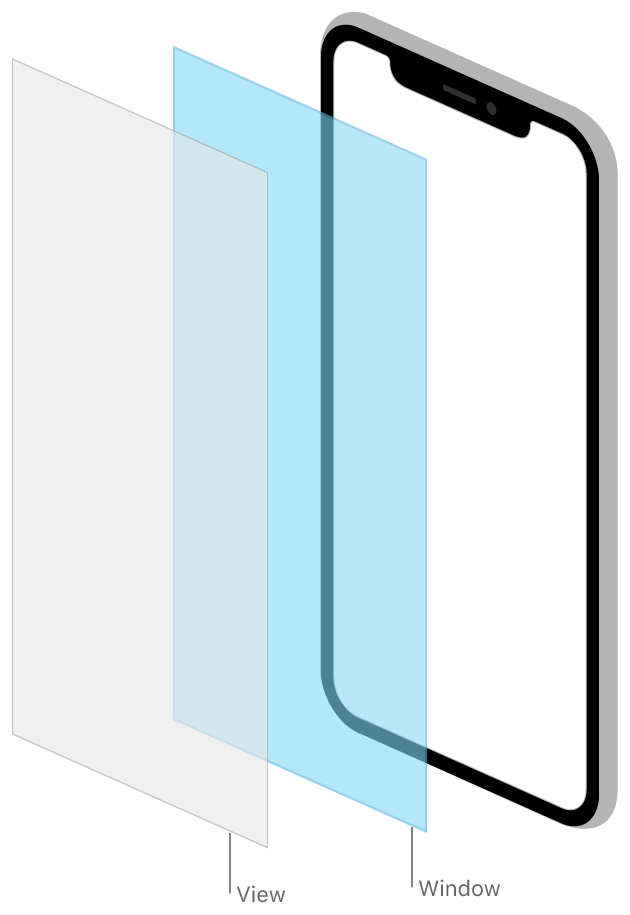

# Windows and Screens

## Info
> **Type**: `Collection`
>
> **최근 수정일**: `2021-05-13`
>
> [원문 링크](https://developer.apple.com/documentation/uikit/windows_and_screens)

**Framework**

- UIKit

## Overview

윈도우 객체는 앱의 화면 콘텐츠에 대한 컨테이너 역할을 하며 스크린은 메인(underlying) 디스플레이의 특성을 앱에 보고합니다. 이 객체들을 사용해 화면에 표시되는 콘텐츠를 관리하세요. 모든 디바이스에는 디바이스의 메인 화면을 나타내는 [UIScreen](https://developer.apple.com/documentation/uikit/uiscreen) 객체가 하나 이상 있으며, 추가적인 스크린 객체는 연결된 디스플레이를 나타냅니다.

[UIWindow](https://developer.apple.com/documentation/uikit/uiwindow) 객체는 보이는 콘텐츠를 자체적으로 제공하지 않습니다. 윈도우의 보이는 모든 콘텐츠는 앱의 스토리보드에서 설정한 루트 뷰컨트롤러에서 제공합니다. 윈도우의 역할은 UIKit으로부터 이벤트를 수신하고 관련된 모든 이벤트를 루트 뷰컨트롤러 및 연관된 뷰로 전달하는 것입니다. UIKit은 사용할 수 있는 이니셜 윈도우를 제공하며, 필요에 따라 추가 윈도우를 생성할 수 있습니다. 예를 들어, 디바이스에 연결된 추가 스크린에 대한 새 윈도우를 만듭니다.

## Topics

---

### Windows

- [`class UIWindow`](https://developer.apple.com/documentation/uikit/uiwindow)

  앱의 사용자 인터페이스에 대한 배경(backdrop)과 이벤트를 뷰로 전달하는 객체

- [`protocol UICoordinateSpace`](https://developer.apple.com/documentation/uikit/uicoordinatespace)

  스크린 위 서로 다른 참조 프레임(frames of reference)간 변환을 위한 메서드 집합

---

### Scenes

- [Scenes](https://developer.apple.com/documentation/uikit/app_and_environment/scenes)

  앱의 여러 UI 인스턴스를 동시에 관리하고, 리소스를 적절한 UI 인스턴스로 전달합니다.

---

### Popovers

- [Displaying Transient Content in a Popover](https://developer.apple.com/documentation/uikit/windows_and_screens/displaying_transient_content_in_a_popover)

  iPad에서 앱의 콘텐츠 위에 임시 인터페이스를 보여줍니다.

- [`class UIPopoverPresentationController`](https://developer.apple.com/documentation/uikit/uipopoverpresentationcontroller)

  popover의 콘텐츠 표시를 관리하는 객체

- [`class UIPopoverBackgroundView`](https://developer.apple.com/documentation/uikit/uipopoverbackgroundview)

  popover의 배경 모습

- [`protocol UIPopoverBackgroundViewMethods`](https://developer.apple.com/documentation/uikit/uipopoverbackgroundviewmethods)

  [UIPopoverBackgroundView](https://developer.apple.com/documentation/uikit/uipopoverbackgroundview) 를 상속하는 클래스가 반드시 구현해야하는 메서드 집합

---

### Alerts

- [Getting the User's Attention with Alerts and Action Sheets](https://developer.apple.com/documentation/uikit/windows_and_screens/getting_the_user_s_attention_with_alerts_and_action_sheets)

  사용자에게 중요한 정보를 제공하거나 중요한 선택에 대한 프롬프트를 제공하세요.

- [`class UIAlertController`](https://developer.apple.com/documentation/uikit/uialertcontroller)

  사용자에게 얼럿 메시지를 표시하는 객체

- [`class UIAlertAction`](https://developer.apple.com/documentation/uikit/uialertaction)

  사용자가 얼럿의 버튼을 누를 때 수행할 수 있는 액션

---

### Screens

- [Displaying Content on a Connected Screen](https://developer.apple.com/documentation/uikit/windows_and_screens/displaying_content_on_a_connected_screen)

  앱의 추가 콘텐츠로 연결된 디스플레이를 채우세요.

- [`class UIScreen`](https://developer.apple.com/documentation/uikit/uiscreen)

  하드웨어 기반 디스플레이와 관련된 프로퍼티를 정의하는 객체

- [`class UIScreenMode`](https://developer.apple.com/documentation/uikit/uiscreenmode)

  스크린 객체에 적용될 수 있는 속성 집합

## See Also

---

### User Interface

- [Views and Controls](https://developer.apple.com/documentation/uikit/views_and_controls)

  콘텐츠를 화면에 표시하고 해당 콘텐츠에 허용된 인터랙션을 정의합니다.

- [View Controllers](https://developer.apple.com/documentation/uikit/view_controllers)

  뷰컨트롤러를 사용해 인터페이스를 관리하고 앱 콘텐츠 탐색을 용이하게 합니다.

- [View Layout](https://developer.apple.com/documentation/uikit/view_layout)

  인터페이스의 뷰를 자동으로 레이아웃하기 위해 스택뷰를 사용하세요. 뷰의 정확한 배치가 필요한 경우 오토레이아웃을 사용하세요.

- [Appearance Customization](https://developer.apple.com/documentation/uikit/appearance_customization)

  앱에 다크모드 지원을 추가하고, bars의 생김새(appearance)를 커스텀하며, appearance proxies를 사용해 UI를 수정하세요.

- [Animation and Haptics](https://developer.apple.com/documentation/uikit/animation_and_haptics)

  뷰 기반 애니메이션 및 햅틱을 사용해 사용자에게 피드백을 제공하세요.

